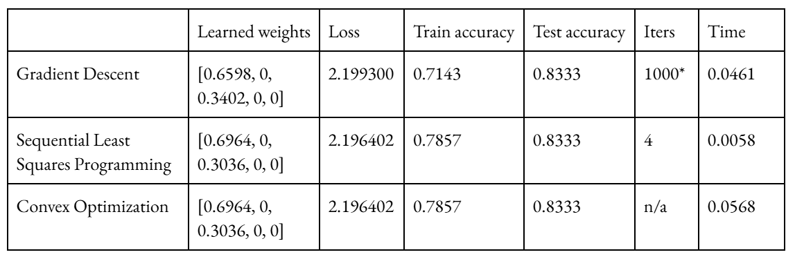

# Week 4 Report

### Problem Statement
Given a large collection of sheet music, the goal is to optimize a similarity metric that will accurately classify one ‘page’ of music as being similar to another page/group of pages and if it is from the same piece. To allow this, we will extract features (harmonic, rhythmic, etc.) from the sheet music and/or learn embeddings.

This problem is interesting as it will allow an understanding of which features of a musical work are most characterizing of it and interactions between those features. It can also be extended to ideas in computing similarity for music recommendation, similarity between pieces by the same composer, between composers, etc.

Success will be measured by classification performance on a held-out test set of page pairs. Specifically, we evaluate accuracy relative to a 0.5 baseline for random guessing, as well as precision, recall, and F1-score. We also track the training loss to ensure optimization convergence and compare weights across different methods.

Some constraints and things that may go wrong  include that there may not be too many resources for extracting features from sheet music and we can be constrained by the amount of data of sheet music that is digitized on the internet. It is also unclear what linear/nonlinear models will be able to capture similarity well as well as understanding interactions between features. The data needed would be large amounts of symbolic music scores that we have found available on music21 presently but may need more as we progress in the project.

### Technical Approach
1. Processing: Extract sheet music-based features using music21 and define similarity metrics for each of these. Specify pages, requirements on number of measures, etc. and extract these features for each page.
2. Mathematical Formulation: Formulate as a constrained optimization problem, the goal is to minimize the squared error loss based on correct/incorrect classification as from the same piece or not. The similarity vector will contain the similarity of the features (m = 5 in our initial example).

For a pair of pages with similarity vector **s** = [s₁, s₂, s₃, s₄, s₅]:

$\text{Overall Similarity} = \mathbf{w}^T \mathbf{s} = \sum_{k=1}^{m} w_k \cdot s_k$

$\text{Minimize: } L(\mathbf{w}) = \sum_{(i,j) \in \text{training pairs}} \left( \text{label}_{ij} - \mathbf{w}^T \mathbf{s}_{ij} \right)^2$

Subject to:
* $\sum_{k=1}^{m} w_k = 1$ (weights sum to 1)
* $w_k \geq 0$ for all $k \in \{1,2,3,4,5\}$ (non-negative weights)
  

3. Optimization Methods: Use various algorithms to learn weights for a weighted similarity function to distinguish matching vs. non-matching pages.
    1. Projected Gradient Descent: This projected method was chosen because it will allow us to remain in the feasible set. This is implementable with PyTorch using methods we have discussed in class. The weight vector would be a learnable parameter and updated with auto-differentiation, followed by projection to enforce the simplex constraints.
    2. Sequential Least Squares Programming (SLSQP): The function scipy.optimize.minimize was chosen because it can be used for constrained, non-convex optimization problems.
    3. Convex optimization (via CVXPY library): This method was chosen as the optimization problem is a geometric program and thus such a solver can give us the optimized weights.
4. Validation:: We will validate performance on a held-out testing set of matching and non-matching page pairs. For training, we will monitor training loss to see how the optimization/convergence is happening.
5. Resource requirements and constraints: Will depend on the amount of data we obtain and features we extract, but should be a reasonable amount as linear models at least would not be too complex.

### Initial Results
Our initial approach involved a simplified formulation using a small number of musical works from music21’s corpus (10 Bach chorale cantatas). We look at 5 features which were [key signature, time signature, average pitch of the soprano part, pitch range, and note density]. Initially we created 10 matching pairs (same piece) and 10 non-matching pairs (different pieces) to test how feature comparisons looked. The training data consists of 7 non-matching pairs and 7 matching pairs, and the test data had 3 of each of these.

Results as follows:

*learning rate: 0.0001, max_iterations=1000, tolerance=1e-6 (see technical challenges section)

This shows our implementation can work since we are able to achieve accuracies > 0.5. The most important features are key and average pitch range which make sense since the Bach chorales are very tonal, and these two features are likely correlated. For the test set we get 3 true positives, 2 true negatives, and 1 false positive. The precision is 0.75, recall is 1.0, F1-score is 0.8571. Some current limitations and unexpected challenges included:
- Features and similarity metrics need reevaluation for instance representing time signature as a decimal does not make sense, some ‘normalizations’ that occur for similarity calculation don’t make sense
- Related to this the feature set is clearly very limited as it was just 5 features, the dataset too, evidently
- It was difficult to determine learning rate, iterations, and tolerance for the gradient descent

### Next Steps
Immediate improvements
- Some other features to consider are chords for harmonic similarity, more complex rhythm patterns, motifs, melodic contour features, major/minor/dominant key relationships, etc.
- Improved evaluation with cross-validation, threshold optimization (currently fixed at 0.5)

Technical challenges to address / Questions we may need help with
- The gradient descent behaves strangely, after around iteration 1000 the loss begins to increase and also the change in weight each time. So it is not able to fully converge to the optimal value.
- The problem right now is convex, so developing meaningful ways to make it more complicated.

Alternative approaches
- This is a simple linear weighted sum model and assumes independence among features, thus may not capture complex relationships; the squared error loss is similarly simple. Alternatives may be logistic regression, hinge loss, ranking losses, cross-entropy with softmax
- Mahalanobis distance: learning a covariance matrix accounting for correlation between features
- (Convolutional) neural networks, kernel methods, and decision tree methods
- Metric learning approaches: triplet loss, contrasting loss, large margin nearest neighbor
- Learning embeddings and working with transformer models