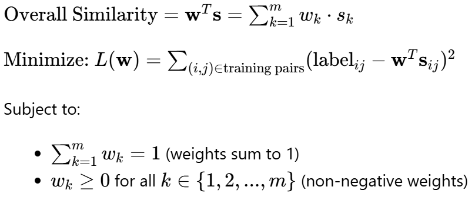
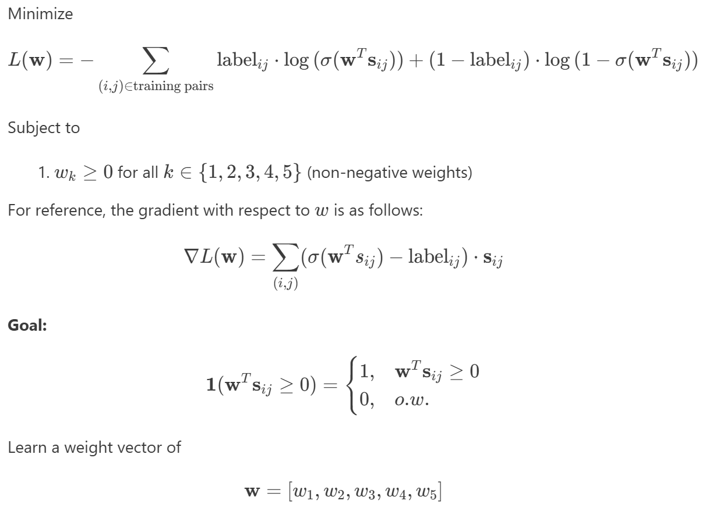

# Week 6 Report

This draft 2 of the report expands on the initial experiments done in draft 1 which used linear regression, to now discuss results based on a larger dataset using logistic regression.

### Problem Statement
Given a large collection of sheet music, the goal is to optimize a similarity metric that will accurately classify one ‘page’ of music as being similar to another page/group of pages and if it is from the same piece. To allow this, we will extract features (harmonic, rhythmic, etc.) from the sheet music and/or learn embeddings.

This problem is interesting as it will allow an understanding of which features of a musical work are most characterizing of it and interactions between those features. It can also be extended to ideas in computing similarity for music recommendation, similarity between pieces by the same composer, between composers, etc.

Success will be measured by classification performance on a held-out test set of page pairs. Specifically, we evaluate accuracy relative to a 0.5 baseline for random guessing, as well as precision, recall, and F1-score. We also track the training loss to ensure optimization convergence and compare weights across different methods.

Some constraints and things that may go wrong  include that there may not be too many resources for extracting features from sheet music and we can be constrained by the amount of data of sheet music that is digitized on the internet. It is also unclear what linear/nonlinear models will be able to capture similarity well as well as understanding interactions between features. The data needed would be large amounts of symbolic music scores that we have found available on music21 presently but may need more as we progress in the project.

### Technical Approach
1. Processing: Extract sheet music-based features using music21 and define similarity metrics for each of these. The 5 features chosen for the initial experiments were [key, time signature, average pitch, pitch range, note density] with heuristic-based similarity functions for each. Specify pages, requirements on number of measures, etc. and extract these features for each page.
2. Mathematical Formulation: For the initial experiments we used two types of regression. Initially we used linear regression and minimized the squared error loss formulated as a constrained optimization problem (see report draft 1), however this was not the ideal approach since we are dealing with a binary classification problem rather than prediction of some continuous value. A more appropriate method is logistic regression, which predicts match/non-match based on the sigmoid of the logits and whether it is $\geq 0.5$, or equivalently whether the logits are $\geq 0$.

Whereas previously we had

Now we have

**Features:** The similarity vectors previously contained values from 0-1, now they are re-scaled to be between -1 to 1 where 1 would mean they are more similar and -1 if they are less similar. Define $s = [s1, s2, s3, s4, s5]$

**Labels:** Same as previously, 1 for match (two pages from the same piece), 0 for non-match (two pages from different pieces, with also a further distinction of easy negative and hard negative referring to different pieces of different composers and the same composer, respectively)

**Loss (as optimization problem):**
Negative log-likelihood loss (Binary Cross-Entropy Loss). This is evidently also a convex loss. Taking out the constraint for the weights to have to sum to 1 as that considerably limited the performance.

For this case, one thing that was changed was removal of the constraint that all weights had to sum to 1, as that seemed to drastically decrease performance. But still maintaining that the weights should be non-negative (i.e. pieces being more similar in an area cannot mean that they will contribute negatively to the overall likeliness of it being a match)

that is optimized for classification based on the above where $\mathbf{1}$ is the indicator function. The behavior of the sigmoid is that it converts values from $-\infty$ to $\infty$ into probabilities and is centered around 0 so this works.

3. Optimization Methods: Use various algorithms to learn weights for a weighted similarity function to distinguish matching vs. non-matching pages.
    1. Projected Gradient Descent: This projected method was chosen because it will allow us to remain in the feasible set. The weight vector would be a learnable parameter which would be updated by going in the direction of the negative gradient, followed by projection to enforce the constraint of all weights being non-negative. This is implemented using PyTorch with a loop going through some fixed number of iterations, from which we will exit if the stopping condition is met (based on some tolerance for the norm of the gradient). torch.nn.functional.binary_cross_entropy_with_logits is chosen for loss calculation for better numerical stability.
    2. Sequential Least Squares Programming (SLSQP): The function scipy.optimize.minimize was chosen because it can be used for constrained, non-convex optimization problems. This should yield the same solution as the convex solver.
    3. Convex optimization (via CVXPY library): This method was chosen as the optimization problem is a quadratic program (previously misstated in report 1...) with a quadratic objective and linear constraint, and thus such a solver can give us the optimized weights.
4. Validation:: We will validate performance on a held-out testing set of matching and non-matching page pairs. For training, we will monitor training loss to see how the optimization/convergence is happening.
5. Resource requirements and constraints: Will depend on the amount of data we obtain and features we extract, but should be a reasonable amount as linear models at least would not be too complex.

### Initial Results
Our **initial approach with linear regression** involved a simplified formulation using a small number of musical works from music21’s corpus (10 Bach chorale cantatas). We look at 5 features which were [key signature, time signature, average pitch of the soprano part, pitch range, and note density]. Initially we created 10 matching pairs (same piece) and 10 non-matching pairs (different pieces) to test how feature comparisons looked. The training data consists of 7 non-matching pairs and 7 matching pairs, and the test data had 3 of each of these.

Results as follows:
| | Learned weights | Loss | Train Accuracy | Test Accuracy | Iters | Time (s) |
| --- | --- | --- | --- | --- | --- | --- |
| Projected Gradient Descent | [0.6598, 0, 0.3402, 0.0] | 2.199300 | 0.7143 | 0.8333 | 1000* | 0.0461
| Sequential Least Squares Programming | [0.6964, 0, 0.3036, 0, 0] | 2.196402 | 0.7857 | 0.8333 | 4 | 0.0058
| Convex Optimization | [0.6964, 0, 0.3036, 0, 0] | 2.196402 | 0.7857 | 0.8333 | N/A | 0.0568

\* learning rate = 0.0001, max_iterations=1000, tolerance=1e-6

This shows our implementation can work since we are able to achieve accuracies > 0.5. The most important features are key and average pitch range which make sense since the Bach chorales are very tonal, and these two features are likely correlated. For the test set we get 3 true positives, 2 true negatives, and 1 false positive. The precision is 0.75, recall is 1.0, F1-score is 0.8571. Some current limitations and unexpected challenges included:
- Features and similarity metrics need reevaluation for instance representing time signature as a decimal does not make sense, some ‘normalizations’ that occur for similarity calculation don’t make sense
- Related to this the feature set is clearly very limited as it was just 5 features, the dataset too, evidently
- It was difficult to determine learning rate, iterations, and tolerance for the gradient descent

The **revised approach with logistic regression** involved a change in the constraints (removal of the constraint of summing to 1) and also a change in the stopping criteria as based on the norm of the gradient rather than a plateauing condition based on the norm of the difference between the old and new weight vectors.

These results are also based on an expanded test set which now includes works by Bach, Mozart, and Beethoven such that the training data contained 35 examples (14 matching, 21 non-matching) and the test data contained 15 examples (9 matching, 6 non-matching). This was an improvement from previous work that involved just 10 matching and 10 non-matching pairs. Evidently there was some class imbalance and that affects results, some weighting of classes was also tested, but to no avail as the test set itself was not very large.

Results as follows:
| | Learned weights | Loss | Train Accuracy | Test Accuracy | Iters | Time (s) |
| --- | --- | --- | --- | --- | --- | --- |
| Projected Gradient Descent | [0.0582, 0, 0, 0.2407, 0] | 0.6902 | 0.5429 | 0.5333 | 1000* | 0.2327 
| Sequential Least Squares Programming | [0.0582, 0, 0, 0.2457, 0] | 0.6902 | 0.5429 | 0.5333 | 7 | 0.0489
| Convex Optimization | [0.0575, 0, 0, 0.2446, 0] | 0.6902 | 0.5429 | 0.5333 | N/A | 0.076

\* learning rate = 0.01, max_iterations = 1000, tolerance = 1e-4

As an analysis of these results, it is clear that it reaches a similar conclusion in terms of learned weights and feature importance as with the linear regression. However, whereas the linear regression identified the most importance features as (1) key and (2) average pitch, this logistic regression identified it as (1) pitch range and (2) key. So while key is common between these as well as factors relating to it in general, the weight vector learned to minimize the binary cross entropy loss compared to the squared error loss is slightly different. Some other aspects to note include
- The rescaling of the similarity vectors (inputs to the model) cause them to now be between -1 and 1 rather than from 0 and 1, this is because as logistic regression bases its predicts off of the linear combination of the weight vector and features and is centered around 0, this is necessary or else all predictions will always be positive. On the other hand, the weights are still constrained to be $\geq 0$.
- The loss was not able to decrease too much (only from 0.6930 to 0.6905). Although we attempted with many different combinations of max iterations and learning rates, it was difficult to find a suitable combination and this was found to lead to roughly the best training and test accuracies.
- The performance based on pair time was 0.6667 for matching pairs, 0.25 for hard negatives (different pieces by the same composer), and 0.60 for easy negatives (different pieces by different composers). These results intuitively make sense based on the difficulty ranking.
- Compared to the linear regression, there is some decrease in the train and test accuracies (most likely having to do with the class imbalance and small dataset)

### Next Steps
Immediate improvements
- Some other features to consider are chords for harmonic similarity, more complex rhythm patterns, motifs, melodic contour features, major/minor/dominant key relationships, etc.
- Improved choice of hypermarameters (learning rate, max iterations, tolerance) using grid search or sorts.
- Cross validation for more accurate evaluation of performance.

Technical challenges to address / Questions we may need help with
- As similar to previously, it is still difficult to understand the behavior of the gradient descent and select appropriate hyperparameters for ideal loss decreasing, etc.
- Justifying the removal of the weights having to sum to 1. It makes sense since we have negative similarity scores and now no longer have a weighted average situation. However, it would be important to clarify whether the current choice of scaling similarity values to between -1 and 1 is the best choice and then limiting weights to $\geq 0$

Alternative approaches
- Continued from previously, we may try to continue improving the loss function that is being optimized such as by introducing a regularization term (L1, L2, etc.) to encourage a simpler model to be learned and reduce possibilities of overfitting.
- Mahalanobis distance: learning a covariance matrix accounting for correlation between features
- (Convolutional) neural networks, kernel methods, and decision tree methods
- Metric learning approaches: triplet loss, contrasting loss, large margin nearest neighbor
- Learning embeddings and working with transformer models