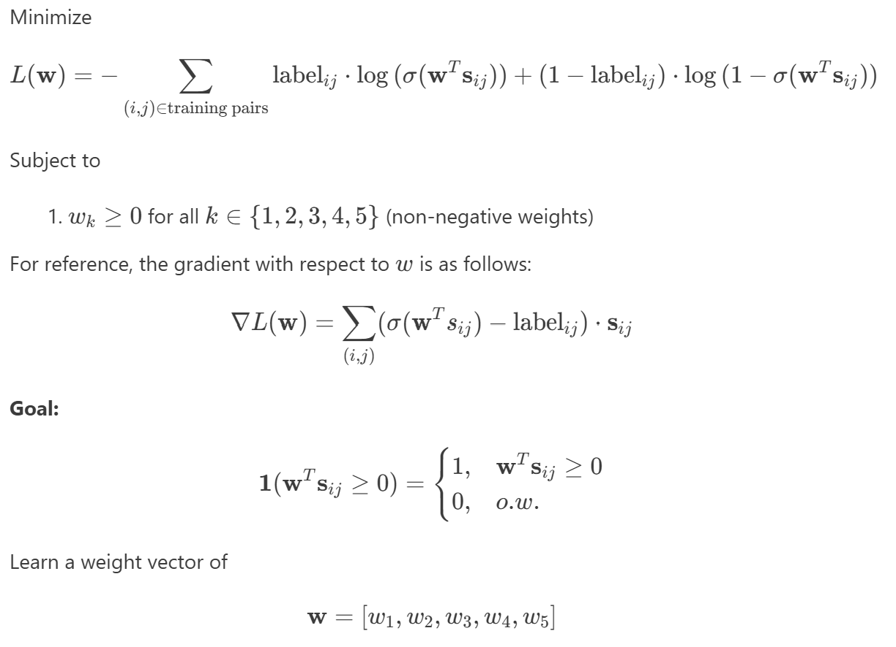
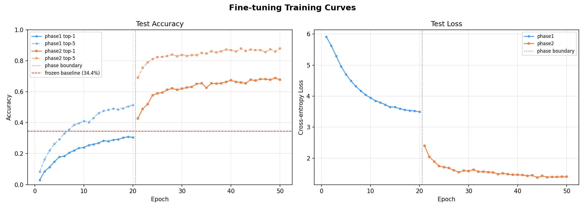

# Week 12 Report
In this report, the approaches (1), (2), (3) are our previous approaches, and we now consider some new methods. Before that, (3.5) of the Technical Approach section discusses how we expanding the data per class via data perturbations directly on the audio waveforms so the model can learn more comprehensively. The other approaches are (4) an MLP architecture search, (5) several iterations of MLP architecture search over the perturbed dataset, (6) use of K-Nearest Neighbors, (7) finetuning of the MERT transformer model, and (8) metric learning. A few of the these were summarized in the report 4 also.

### Problem Statement
Given a large collection of sheet music, the goal is to classify a snippet of  music as coming from a piece, such as whether it matches the piece that another snippet is from, or to directly classify it as a specific piece. To allow this, we will extract features (harmonic, rhythmic, etc.) from the sheet music, use embeddings of audio based on pre-trained model, and later learn embeddings.

This problem as interesting as piece identification from audio snippets is a prerequisite for music recommendation, plagiarism detection, and archival search. We initially attempt to look at understanding of which features of a musical work are most characterizing of it and interactions between those features. Later, rather than hand-designing features, we use MERT — a transformer pre-trained on general audio — to produce rich 768-dimensional representations, then ask: how much piece-identity information do these embeddings already carry, and can a simple linear classifier extract it?

Success will be measured by classification performance on a held-out test set of page pairs. Specifically, we evaluate accuracy relative to a 0.5 baseline for random guessing, as well as precision, recall, and F1-score. We also track the training loss to ensure optimization convergence and compare weights across different methods. For the models based on embeddings where we are predicting the exact piece rather than classification of match vs. non-match, we use top-1 and top-5 accuracy on a held-out test set, against a random baseline of 0.23% (1/430 pieces). Per-class accuracy breakdown reveals whether the model generalizes across pieces or concentrates on a few easy ones.

Some constraints and things that may go wrong include that it is also unclear what linear/nonlinear models will be able to capture similarity well as well as understanding interactions between features. For the embedding appraoch, MERT embeddings are extracted once and cached to disk — no fine-tuning of the transformer. The embedding space was not trained for piece identity, so a linear classifier may be too weak to carve out 430 decision boundaries from it. L2 normalization of embeddings, a common preprocessing step, might discard magnitude information that MERT encodes.

### Technical Approach
We have attempted several problem formulations and types of models in working towards the goal of effective classification. All methods are summarized in order from earliest stages to most recent.

1. **<u>Logistic Regression on Musical Features</u>**

*Processing:* Extract sheet music-based features using music21 and define similarity metrics for each of these. The 5 features chosen for the initial experiments were [key, time signature, average pitch, pitch range, note density] with heuristic-based similarity functions for each. Specify pages, requirements on number of measures, etc. and extract these features for each page.

*Mathematical Formulation*: For the initial experiments we used logistic regression after initially using linear regression (which was not ideal since this is a binary classification problem rather than prediction of some continuous value). In logistic regression, we predict match/non-match based on the sigmoid of the logits and whether it is $\geq 0.5$, or equivalently whether the logits are $\geq 0$. See further details in report1.md and report2.md.

**Features:** The similarity vectors previously contained values from 0-1, now they are re-scaled to be between -1 to 1 where 1 would mean they are more similar and -1 if they are less similar. Define $s = [s1, s2, s3, s4, s5]$

**Labels:** 1 for match (two pages from the same piece), 0 for non-match (two pages from different pieces, with also a further distinction of easy negative and hard negative referring to different pieces of different composers and the same composer, respectively)

**Loss (as optimization problem):**
Negative log-likelihood loss (Binary Cross-Entropy Loss). This is evidently also a convex loss. Taking out the constraint for the weights to have to sum to 1 as that considerably limited the performance.



*Optimization Methods:* Use various algorithms to learn weights for a weighted similarity function to distinguish matching vs. non-matching pages.
1. Projected Gradient Descent: This projected method was chosen because it will allow us to remain in the feasible set. This is implemented using PyTorch with a loop going through some fixed number of iterations, from which we will exit if the stopping condition is met (based on some tolerance for the norm of the gradient). torch.nn.functional.binary_cross_entropy_with_logits is chosen for loss calculation for better numerical stability.
2. Sequential Least Squares Programming (SLSQP): The function scipy.optimize.minimize was chosen because it can be used for constrained, non-convex optimization problems. This should yield the same solution as the convex solver.
3. Convex optimization (via CVXPY library): This method was chosen as the optimization problem is a quadratic program (previously misstated in report 1...) with a quadratic objective and linear constraint, and thus such a solver can give us the optimized weights.

*Validation:* We validated performance on a held-out testing set of matching and non-matching page pairs. For training, we monitor training loss to see how the optimization/convergence is happening.

**<u>2. Logistic Regression on Embeddings</u>**

*Processing:* The pipeline runs in four modular stages: `data_prep.py` loads Bach chorales from Music21 and segments them into snippets; `render.py` converts each snippet to audio via FluidSynth; `embed.py` passes audio through MERT-v1-95M and caches mean-pooled hidden states (768-dim) to disk; and the classification notebook loads the cached embeddings and trains the linear classifier.

*Mathematical Formulation:* Here, we learn a weight matrix $W \in \mathbb{R}^{d \times C}$ (and bias $b \in \mathbb{R}^C$) that maps pre-computed audio embeddings of Bach chorale snippets to piece identity predictions. Concretely, given an embedding $x \in \mathbb{R}^d$ of a snippet, the model computes logits $z = Wx + b \in \mathbb{R}^C$ and predicts the piece via $\hat{y} = \arg\max_c z_c$. We minimize the cross-entropy loss over the training set:

$$\mathcal{L}(W, b) = -\frac{1}{n} \sum_{i=1}^{n} \log \frac{e^{z_{y_i}}}{\sum_{c=1}^{C} e^{z_c}}$$

The model is a single `nn.Linear(768, 430)` layer — multi-class logistic regression. With data matrix $X \in \mathbb{R}^{n \times 768}$ and integer labels $y \in \{0, \ldots, 429\}^n$, the forward pass computes logits $Z = XW^\top + \mathbf{1}b^\top \in \mathbb{R}^{n \times 430}$, and the loss is weighted cross-entropy. Since regularization experiments found no benefit from weight decay (see Results), the final objective is unregularized:

$$\min_{W, b} \; \mathcal{L}(W, b)$$

This is a smooth, unconstrained problem in 330,670 parameters ($768 \times 430 + 430$).

*Optimization Methods:* Adam (lr = 1e-3, weight_decay = 0, batch size 256) is used over 1,000 epochs. Adam is chosen over SGD because the loss landscape has poor conditioning — 430 classes each pulling gradients in different directions across a 768-dimensional input space — and Adam's per-parameter adaptive learning rates compensate for this. A comparison run with SGD + L2-normalized embeddings confirmed the choice: that configuration reached only 4.4% top-1 while Adam on raw embeddings reaches 34.4%. Regularization strength $\lambda$ was swept over $\{10^{-4}, 10^{-6}, 0\}$; test accuracy changed by less than 0.6% across all values, indicating that performance is determined by model capacity rather than overfitting.

*Validation:* Top-1 and top-5 accuracy are computed each epoch on both train and test sets. A per-class accuracy breakdown and confusion matrix identify which pieces are systematically missed or confused.

**<u>3. MLP on Embeddings</u>**

(see w7_mlp.ipynb)

*Processing:* The same pipeline as described in the above 2nd approach is used for generation of embeddings.

*Mathematical Formulation:* We use a one-hidden-layer MLP as an `nn.Module`:
$$x \in \mathbb{R}^{768} \xrightarrow{\text{Linear}} h \in \mathbb{R}^{H} \xrightarrow{\text{ReLU}} \xrightarrow{\text{Dropout}} \xrightarrow{\text{Linear}} z \in \mathbb{R}^{430}$$
$h$ is a hidden representation with $H = 512$, $z$ are the logits. The model has approximately 395,000 trainable parameters. Kaiming uniform initialization is used for both linaer layers which accounts for the ReLU non-linearity — it scales weights by $\sqrt{2/\text{fanin}}$ so that the variance of activations is preserved through each layer at initialization. Dropout is placed after the ReLU activation, meaning that the activation decides which neurons fire and this step  stochastically zeros some of those active units, acting as regularization.

*Optimization Methods:* Adam (lr = 1e-2, weight_decay = 1e-3) is used with a cosine annealing learning rate schedule over 1000 epochs with batch size 256. The loss is cross-entropy loss with involves inverse-frequency class weighting and label smoothing to address the class imbalance. As the MLP loss landscape is non-convex, the cosine annealing schedule which decays at a predetermined rate is helpful.

*Validation:* Same validation as with the above 2nd approach.

**<u>3.5. Data Perturbations</u>**

Goal: Introduce pitch shifting, time stretching to the FluidSynth renders to prevent the model from "memorizing" clean audio. Before moving on to our next method, we employed perturbations to the audio data using the "librosa" library's 'effects' before generating the embeddings, and in doing so made some alterations to the data pipeline, which can be viewed in `perturb.py`.

Some modifications to the pipeline now allow for the pipeline to be entered via music21, MIDI, or WAV files. Rather than creating snippets based on measure numbers from the music21 Score object, the snippets are now creates following perturbations of the audio and based on duration (8 seconds, with 4 seconds overlap to allow more data). These snippets are then embedded with MERT similarly.

The perturbations performed were (1) *tempo change* for which we used 0.9, 0.95, 1.0, 1.05, and 1.1 times the original speed, and (2) *pitch shift* for which we used 0, 1, 2 semitones up/down. Combinations of these changes yield 25 versions. Overall this increased the previous ~7 snippets/piece to now ~179 snippets/piece for a total of 77070 snippets (split across train/test).

**<u>4. MLP Architecture Search </u>**

(see w10_mlp.ipynb)

This was an expansion on the work done in the previous part (3) where we only ran a singular MLP model (with 1 hidden-layer of dimension 512, dropout 0.5). Here, instead we search over 10 MLP architectures based on different combinations of number of hidden layers, dimensions of those hidden layers, and the dropout.

The overall structure was a flexible MLP structure such that the architecture for `hidden_dims=[H1, H2]` where BN is batch norm that is done before the activation:
$$d \xrightarrow{\text{Linear}} H_1 \xrightarrow{[\text{BN}]\,\text{ReLU}\,\text{Drop}} H_2 \xrightarrow{[\text{BN}]\,\text{ReLU}\,\text{Drop}} C$$
The other configurations were kept constant with use of Adam for optimization, and the introduction of the adaptive scheduler that is ReduceLROnPlateau which decreases learning rate if plateau is seen in the test top-1 (with set values for scheduler factor, patience, and min learning rate) seen in the minibatch gradient descent. As usual, we tracked test top-1 and test top-5 accuracies

The specific 12 MLP architectures we looked at were the following combinations of hidden_dims and dropout (randomly selected a selection of configs):
- [512] and 0.3; [512] and 0.5
- [1024] and 0.3; [1025] and 0.4
- [2048] and 0.4; [2048] and 0.5
- [1024, 512] and 0.4
- [2048, 512] and 0.5
- [512, 256, 128] and 0.5
- [1024, 512, 256] and 0.3; [1024, 512, 256] and 0.5
- [2048, 1024, 512] and 0.4

For each of these we train for 300 epochs, and select the best model based on the best test top-1 accuracy seen, for which we then train it for a full 1000 epochs to collect the same metrics. We similarly evaluate per-class accuracies and the confusion matrix with regards to misclassifications.

**<u>5. MLP Architecture Search over Perturbed Dataset </u>**

(see w12_mlp_search.ipynb)
This approach does the exact same thing as approach (4), that is the code is identical, and this notebook is mainly for displaying the results as a result of the MLP search over the aforementioned perturbed dataset (see 3.5).

To comment on the previous data perturbations, we had observed misleading results (accuracies of > 0.8) as reported in the past report 4 as a result of data leakage. This was because in splitting the perturbed audio snippets into train and test splits, consideration was not given that when a snippet and a perturbed version of it was placed in the same split, it would be easily classified. To fix this, we created a new set of perturbations (see most recent perturb.py) wherein the now the process is to first snippet the pieces -> perturb each snippet -> assign all perturbations of a snippet to either train/test. 

For this, we also used a new set of perturbations with tempos [0.8, 0.9, 1.0, 1.1, 1.2] and pitch changes [-2, -1, 0, 1, 2]. That is, the tempos were changed to be more drastic. An additional measure to prevent data leakage but still retain the information given by overlaps is to reduce the snippeting from 8s with 4s overlap to 8s with 2s overlap.

The specific 10 MLP architectures we looked at were the following combinations of hidden_dims and dropout.
- [512] and 0.2; [512] and 0.5
- [1024] and 0.2; [1025] and 0.5
- [2048] and 0.2
- [2048, 512] and 0.3; [2048, 512] and 0.5
- [512, 256, 128] and 0.5
- [1024, 512, 256] and 0.3; [1024, 512, 256] and 0.5

**<u>6. K-Nearest Neighbors </u>**

Using a reconfiguration of the experiment pipeline (see 'deployed' directory) for better modular structure managed with uv, we ran KNN on the unperturbed embeddings as well as the perturbed embeddings (data leakage version). This was directly using the KNeighborsClassifier from scikit-learn for which we try values of K between 1 and 49. The similarity metric was fixed to be cosine similarity. We collected similar results from this that were top-1 and top-5 test accuracies and compared the results with the perturbed vs. unperturbed and also comparing with the baseline.

**<u>7. Finetuning of MERT </u>**

(see the finetuning folder, mainly finetune_caching_disk.py)

We conducted an end-to-end finetuning of MERT in 2 phases as discussed below:

Phase 1 — Warm up classifier head using precomputed embeddings (MERT never runs). Fast: identical to w7_mlp_search but using the best architecture. Requires data/embeddings/embeddings_train.npy to already exist.

Phase 2 — Unfreeze top N transformer layers of MERT and train end-to-end from raw audio with differential learning rates.

Why two phases:
  Without saved MLP weights, a random head sends noisy gradients into MERT
  from the first step, risking catastrophic forgetting. Phase 1 ensures the
  head produces a meaningful signal before transformer weights are touched.
  By using precomputed embeddings in Phase 1, we avoid running MERT at all
  until it actually needs to be fine-tuned — making Phase 1 nearly instant.

Best MLP architecture (from w7_mlp_search):
  768 → BN → 512 → ReLU → Dropout(0.3) → 430

To help with time, a **caching optimization** was implemented:

Only the top N MERT layers are unfrozen, so the bottom (12 - N) layers produce identical outputs every epoch. We precompute and cache their output once before Phase 2 begins, then each training step only runs the top N layers + head. This reduces MERT compute per batch from 12 layers down to N layers.

Cache is stored in CPU RAM as per-snippet tensors of shape (T_i, 768), where T_i is the number of time frames for snippet i. At ~400 frames × 2487 snippets × 768 dims × 4 bytes ≈ 3 GB — fits in Colab RAM.

The cache is rebuilt whenever unfreeze_layers changes, since the boundary layer shifts and old cached values would be wrong.

Finally, following the finetuning, we saved the model weights and conducted similar MLP search as we had previously with the same 10 configurations of models.

**<u>8. Metric Learning </u>**

This model is designed for **piece prediction from fixed-length, mean-pooled MERT embeddings**. The goal is to improve class separation over a standard MLP classifier without requiring access to the pre-mean-pool embedding sequences.

The key idea is to keep the current input representation pipeline unchanged while replacing the standard classification head with a **geometry-aware embedding classifier**. Instead of only learning logits for cross-entropy, the model learns a projected embedding space in which snippets from the same musical piece cluster more tightly and snippets from different pieces are pushed farther apart

The high level structure is as follows
```text
mean-pooled MERT embedding
    -> projection network
    -> normalized embedding
    -> cosine / ArcFace classifier head
    -> class logits
```
Where essentially 3 variants were tested: standard projection + softmax, projection + cosine classifer, and projetion + arcface classifer.

For cosine:
Let:

- `\hat{h}` be the normalized projected embedding
- `\hat{w}_c` be the normalized weight vector for class `c`

Then the class score is:

```math
z_c = s \cdot \hat{w}_c^T \hat{h}
```

where:

- `s` is a scaling factor
- `\hat{w}_c^T \hat{h}` is the cosine similarity between the embedding and the class prototype

For ArcFace:
ArcFace modifies the target class score by adding an angular margin.

Let:

```math
\cos(\theta_y) = \hat{w}_y^T \hat{h}
```

For the correct class `y`, ArcFace uses:

```math
z_y = s \cdot \cos(\theta_y + m)
```

For all incorrect classes:

```math
z_c = s \cdot \cos(\theta_c), \quad c \neq y
```

where:

- `m` is the angular margin
- `s` is a scaling factor


### Results
**<u>1. Logistic Regression on Musical Features</u>**

For our initial approach using feature vectors that are 5 selected musical features, the results are based on a test set with works by Bach, Mozart, and Beethoven such that the training data contained 35 examples (14 matching, 21 non-matching) and the test data contained 15 examples (9 matching, 6 non-matching). Evidently there was some class imbalance and that affects results, some weighting of classes was also tested, but to no avail as the test set itself was not very large.

Results as follows:
| | Learned weights | Loss | Train Accuracy | Test Accuracy | Iters | Time (s) |
| --- | --- | --- | --- | --- | --- | --- |
| Projected Gradient Descent | [0.0582, 0, 0, 0.2407, 0] | 0.6902 | 0.5429 | 0.5333 | 1000* | 0.2327 
| Sequential Least Squares Programming | [0.0582, 0, 0, 0.2457, 0] | 0.6902 | 0.5429 | 0.5333 | 7 | 0.0489
| Convex Optimization | [0.0575, 0, 0, 0.2446, 0] | 0.6902 | 0.5429 | 0.5333 | N/A | 0.076

\* learning rate = 0.01, max_iterations = 1000, tolerance = 1e-4

As an analysis of these results, it is clear that it reaches a similar conclusion in terms of learned weights and feature importance as with the linear regression. However, whereas the linear regression identified the most importance features as (1) key and (2) average pitch, this logistic regression identified it as (1) pitch range and (2) key. So while key is common between these as well as factors relating to it in general, the weight vector learned to minimize the binary cross entropy loss compared to the squared error loss is slightly different (see report2.md for details).

**<u>2. Logistic Regression on Embeddings</u>**

The pipeline runs end-to-end successfully. From 430 Bach chorales, it produces 2,487 training snippets and 521 test snippets (768-dimensional MERT embeddings each). The linear classifier has 330,670 trainable parameters.

After 1,000 epochs with Adam, the model achieves **34.4% top-1 and 56.4% top-5 test accuracy** against a random baseline of 0.23% — a 150× improvement over chance. This confirms that MERT embeddings contain genuine piece-identity signal that a linear classifier can access.

The results reveal a clear capacity ceiling. Training accuracy reaches 99.8% while test accuracy plateaus at 34.4% with no upward trend across 1,000 epochs. Sweeping weight decay across three orders of magnitude ($10^{-4}$ to $0$) produced no meaningful change in test accuracy, ruling out overfitting as the primary bottleneck. The diagnosis is instead a model capacity problem: a linear decision boundary in 768-dimensional space is insufficient to separate 430 classes whose embeddings are not linearly arranged.

Per-class analysis confirms this. Median per-class accuracy is 0%, with only 8 of 430 pieces identified at 100% and 410 pieces at 0%. The aggregate 34.4% is carried almost entirely by those 8 easy pieces — likely ones with distinctive harmonic content that produces separable embeddings. The confusion matrix shows bwv248.64-6 and bwv79.3 acting as prediction attractors, absorbing misclassifications from dozens of other chorales.

Two key implementation lessons emerged from debugging. First, applying L2 normalization to MERT embeddings before the linear layer dropped top-1 accuracy from 34.4% to ~4.4% — MERT embedding magnitudes carry piece-identity information and normalizing to unit length discards it.

**<u>3. MLP on Embeddings</u>**

In comparison with attempt 2, after 1,000 epochs with Adam, this model achieves **27.4% top-1 and 51.1% top-5 test accuracy** against a random baseline of 0.23%. This is a similar top-5 test accuracy as the previous logistic regression model, but a slightly lower top-1 accuracy.

Similar capacity ceilings as the logistic regression also exist upon evaluating loss and accuracy curves. Training accuracy for top-5 reaches nearly 100% while test accuracy for the same plateaus at around 50% around 1/5 of the way into the 1000 epochs.

For the per-class analysis, we find that median per-class accuracy is still 0%, but with considerable improvement of **102 of 430 pieces identified at 100%** and 308 pieces at 0%. While the logistic regression model yielded more pieces which had 2+ snippets confused with another particular piece, this model had just 10 pieces which had 2 snippets confused with another particular piece (all other pairs of pieces confused was a one-off occurrence).

Upon closer manual analysis of the failure cases, meaningful patterns can be seen in the pieces confused for each other, whereas similar patterns could not be seen in the logistic regression. Fewer, specific misclassifications were noted, which can mainly be attributed to pieces being in the same key, and a secondary attribute is potentially similar rhythms (ex. lots of duplets, 3/4, etc.). One such 'misclassification' was actually correct due to the pieces being different harmonizations of the same chorale.

The following examples are given, numbers are BWV (Bach works catalog) numbers:

*Same chorale:* 149.7 + 340

*Same key (+ time signature/rhythms often):*
- 172 + 248.42-4 + 155.5, 325 + 281 (F)
- 137.5 + 19.7 (C)
- 140.7 + 245.40 (E flat)
- 187.7 + 341, 378 + 374 (g minor)
- 288 + 277 (d minor?)

Same-key misclassifications accounted for 172 of 379 total misclassifications. The fraction of misclassifications where the key was same was calculated to be 45.38% (via music21). Compare to the probability that two random pieces share the same key: 8.8% (although number not based on number of snippets), this is a significant result suggesting that key is a primary factor in classification (echoing some past results based on linear/logistic regression on musical features).

**<u>4. MLP Architecture Search </u>**

The results from the 12 configs showed that the best models were the ones with just one layer that included hidden dimension [512] and dropout 0.3 with test top-1 accuracy of around 38%, closely followed by [1024] + 0.3 dropout, [512] + 0.5 dropout, [2048] + 0.4 dropout, [1024] + 0.4 dropout, and [2048] + 0.5 dropout. It is interesting that all configurations with $\geq 2$ layers performed worse, with 4 that were worse that the baseline of 34.4% from logistic regression. Namely, the worst were [512, 256, 128] with dropout 0.5 which had a test top-1 accuracy of roughly 27% and [1024, 512, 256] with dropout 0.5 with roughly 33%.

After training the best model with 1000 epochs, it should be noted that accuracy curves plateaued relatively quickly around 400 epochs, and quickly there is significant overfitting as train accuracies are near 100% whereas the **test top-1 accuracies end up at around 38%**. This is an improvement from the previous MLP with 1 hidden-layer that we tried and also slightly better than logistic regression.

**<u>5. MLP Architecture Search over Perturbed Dataset </u>**

The results for the searching across the 10 configurations are as follows. Note that this was on the dataset with data leakage, so there the results should be interpreted in that context.
| #  | hidden_dims        | dropout_p | n_params  | best_test_top1 | best_test_top5 | final_test_top1 |
|----|--------------------|-----------|-----------|----------------|----------------|------------------|
| 1  | [2048, 512]        | 0.5       | 2,849,197 | 0.8775         | 0.9655         | 0.8774           |
| 2  | [2048, 512]        | 0.3       | 2,849,197 | 0.8754         | 0.9609         | 0.8738           |
| 3  | [1024, 512, 256]  | 0.3       | 1,557,421 | 0.8730         | 0.9647         | 0.8699           |
| 4  | [1024]             | 0.5       | 1,229,229 | 0.8574         | 0.9442         | 0.8566           |
| 5  | [2048]             | 0.2       | 2,458,029 | 0.8521         | 0.9435         | 0.8508           |
| 6  | [1024, 512, 256]  | 0.5       | 1,557,421 | 0.8455         | 0.9598         | 0.8426           |
| 7  | [1024]             | 0.2       | 1,229,229 | 0.8393         | 0.9412         | 0.8389           |
| 8  | [512]              | 0.5       | 614,829   | 0.8340         | 0.9426         | 0.8340           |
| 9  | [512]              | 0.2       | 614,829   | 0.8303         | 0.9389         | 0.8272           |
| 10 | [512, 256, 128]   | 0.5       | 615,085   | 0.7330         | 0.9337         | 0.7270           |

Based on this, the best model was [2048, 512] as the hidden dimensions with a dropout of 0.5, which had a best top-1 of 0.8775. Closely following that are [2048, 512] with a dropout of 0.3 and [2048, 512, 256] with a dropout of 0.3. While these first three all consists of $\geq$ 2 hidden layers, it was not always true that more layers led to more accuracy since [512, 256, 128] with dropout of 0.5 performed significantly worse than all the rest with only a top-1 accuracy of 0.7330. This is heavily contrasted with the previous MLP search over unperturbed data which performed better when there was just 1 hidden layer.

We did not train this best model for 1000 epochs based on previous observations that the plateau happened around 300 epochs anyways and since the results are inflated due to the data leakage. In any case, such behavior in the context of data leakage is unfavorable for our purposes but it does mirror the task of something like cover song identification in the ability to still classify a piece correctly despite small variations in pitch and tempo.

Continuing from here, after doing revised perturbations which corrected for the data leakage issue, the results were as follows over the same 10 MLP configurations.
| #  | hidden_dims        | dropout_p | n_params  | best_test_top1 | best_test_top5 | final_test_top1 |
|----|--------------------|-----------|-----------|----------------|----------------|------------------|
| 1  | [2048, 512]        | 0.5       | 2,836,885 | 0.4491         | 0.6781         | 0.4457           |
| 2  | [1024, 512, 256]  | 0.5       | 1,551,253 | 0.4483         | 0.6930         | 0.4445           |
| 3  | [1024, 512, 256]  | 0.3       | 1,551,253 | 0.4390         | 0.6778         | 0.4363           |
| 4  | [2048, 512]        | 0.3       | 2,836,885 | 0.4362         | 0.6662         | 0.4340           |
| 5  | [512, 256, 128]   | 0.5       | 611,989   | 0.4149         | 0.6891         | 0.4056           |
| 6  | [1024]             | 0.5       | 1,204,629 | 0.4073         | 0.6294         | 0.4046           |
| 7  | [512]              | 0.5       | 602,517   | 0.3993         | 0.6155         | 0.3959           |
| 8  | [1024]             | 0.2       | 1,204,629 | 0.3952         | 0.6085         | 0.3928           |
| 9  | [2048]             | 0.2       | 2,408,853 | 0.3941         | 0.6032         | 0.3829           |
| 10 | [512]              | 0.2       | 602,517   | 0.3866         | 0.6094         | 0.3866           |

This is considerably different from the results of the MLP on the unperturbed dataset (which had architectures with only 1 layer being more favorable), and is more similar to that of the results of the data leakage version of the perturbed dataset. The configuration that performed the best was [2048, 512] and 0.5 dropout which had a best test top-1 accuracy of 44.91%, and the worst five configurations were all the ones with 1 layer that we tested, with the worst one being [512] with 0.2 dropout which had best test top-1 of 38.66%.

After running 1000 epochs on the best model (albeit still resulting in overfitting and quick plateauing), we achieved a result of final **test top-1 accuracy of 44.22%** and final **test top-5 accuray of 67.67%** which is very much comparable to what we got after 300 epochs.

**<u>6. K-Nearest Neighbors </u>**

The results for accuracies on the embeddings that were from the initial unperturbed dataset are as follows:
- Top-1 Acc: 0.2035
- Top-5 Acc: 0.3378

Then, for the perturbed dataset it was as follows. Similar to the MLP search over the same dataset, these are results due to the data leakage which led to very high accuaracies due to classification of pieces and their perturbations easily since versions of the same snippet were often in the same side of the train/test split.
- Top-1 Acc: 0.8085
- Top-5 Acc: 0.9325

**<u>7. Finetuning of MERT </u>**
The training curves for test accuracy and test loss across phase 1 and phase 2 are shown below.


**<u>8. Metric Learning </u>**

The results found for the best results from this were 4% worse in top-1 accuracy as well as in top-5 accuracy compared to the MLP search over the perturbed dataset, so around 40% and 63% respectively. More analysis needs to be done on the results of this.


### Next Steps
**Understand the embedding space** Before scaling model capacity further, computing pairwise distances between same-piece vs. different-piece snippets in the raw MERT space would clarify whether the bottleneck is classifier capacity or embedding geometry. If same-piece snippets do not cluster geometrically, no classifier trained on frozen embeddings will solve the problem — and the right response is fine-tuning MERT rather than deepening the classification head.

**Metric learning** This directly optimizes the embedding geometry rather than just the classification head. Use a Triplet Loss or Contrastive Learning (CLAP) approach. Instead of classifying 430 labels, train the model to push embeddings of the same piece together and pull different pieces apart. This way, embeddings can be learned to better support our classification purposes. 

**Continued data perturbations** Consider creating more perturbations beyond the current small changes to create for more robustness, especially more perturbations based on pitch. Try to perturb the embeddings directly, rather than the audio, which may be less interpretable but still be valuable. At the same time, may need to reevaluate computing resources needed / generating those changes during training.

**Further analysis of misclassifications** Currently pieces tend to be misclassfied based on key, but if we may be able to better learn the rhythms, etc. of pieces this may be helpful. Another consideration is whether the number of snippets of a piece (which may range from anywhere from around 3-40) increases its chances of misclassification.

**Continued expansion of dataset**: Going beyond the 430 Bach chorales.
